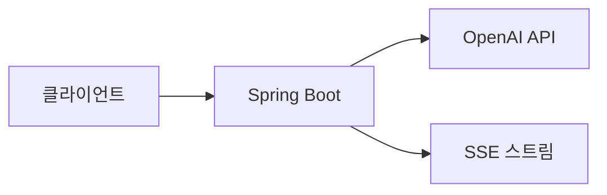

# Career Coach API

*AI 기반 개인 맞춤형 커리어 코칭 서비스*


[](https://openjdk.org/)
[](https://spring.io/projects/spring-boot)
[](https://openai.com/)

---

## 빠른 시작

```bash
# OpenAI API 키 설정
export OPENAI_API_KEY="sk-proj-..."

# 프로젝트 클론 및 실행
git clone <repository-url>
./gradlew bootRun

# API 테스트
curl -X POST http://localhost:8080/api/v1/career-coach/career-coaching/stream \
  -H "Content-Type: application/json" \
  -d '{"jobRole":"백엔드 개발자","careerSummary":"3년차 Spring Boot 개발","techSkills":["Java","Spring Boot"]}'
```

## 주요 기능

| 기능 | 설명 |
|------|------|
| **AI 면접 질문 생성** | 경력과 기술 스택 기반 개인 맞춤형 질문 5개 |
| **학습 경로 추천** | 우선순위와 타임라인이 포함된 맞춤형 로드맵 |
| **실시간 스트리밍** | Server-Sent Events를 통한 실시간 진행상황 |
| **병렬 처리** | 최적화된 성능을 위한 동시 생성 |

## API 엔드포인트

### 커리어 코칭
```http
POST /api/v1/career-coach/career-coaching/stream
Content-Type: application/json
Accept: text/event-stream
```

**요청:**
```json
{
  "jobRole": "백엔드 개발자",
  "careerSummary": "3년차 백엔드 개발자, Spring Boot 기반 서비스 개발",
  "techSkills": ["Java", "Spring Boot", "MySQL", "AWS"]
}
```

**이벤트:**
- `connected` → 연결 설정 완료
- `interview_complete` → 면접 질문 생성 완료
- `learning_complete` → 학습 경로 생성 완료
- `completed` → 전체 작업 완료

### 헬스 체크
```http
GET /api/v1/career-coach/health
```

## 기술 스택



- **백엔드**: Spring Boot 3.x + Java 17
- **AI**: OpenAI GPT-4o-mini with 커스텀 프롬프트
- **스트리밍**: Server-Sent Events
- **동시성**: CompletableFuture 병렬 처리

## 아키텍처 특징

- **병렬 AI 호출**: 면접 질문과 학습 경로 동시 생성
- **스마트 프롬프팅**: STAR 방법론과 개인화된 컨텍스트

## 테스트 케이스

<details>
<summary>다양한 직무별 샘플 요청</summary>

**백엔드 개발자 (3년차)**
```json
{"jobRole": "백엔드 개발자", "careerSummary": "3년차 Spring Boot 개발", "techSkills": ["Java", "Spring Boot", "MySQL"]}
```

**프론트엔드 개발자 (2년차)**
```json
{"jobRole": "프론트엔드 개발자", "careerSummary": "2년차 React 개발자", "techSkills": ["React", "TypeScript", "Next.js"]}
```

**DevOps 엔지니어 (4년차)**
```json
{"jobRole": "DevOps 엔지니어", "careerSummary": "4년차 쿠버네티스 운영", "techSkills": ["Kubernetes", "Docker", "AWS"]}
```

</details>

## 성능 지표

| 지표 | 수치 |
|------|------|
| **동시성** | 병렬 처리로 약 40% 성능 향상 |
| **메모리 사용량** | 로컬 세션 관리로 최적화 |


---

